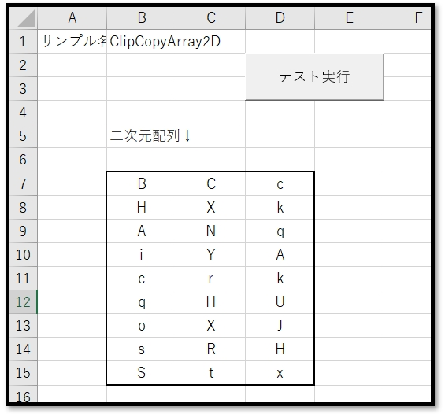
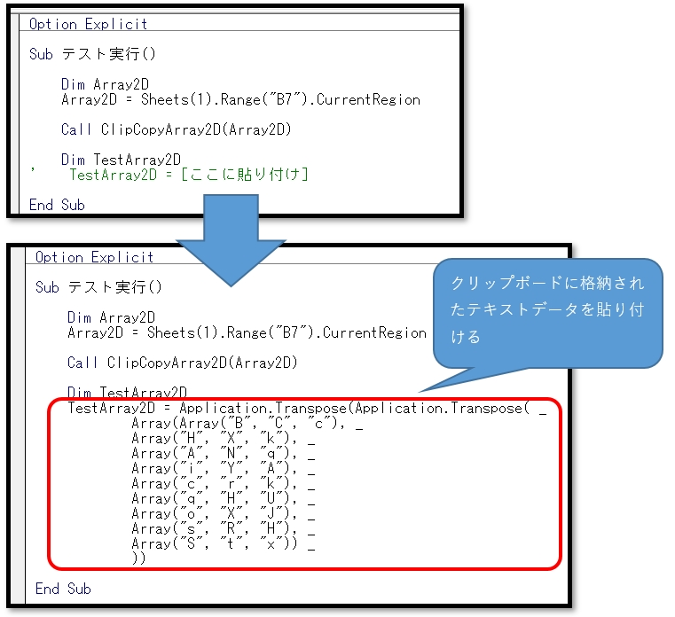

# VBA-CopyClipArray2D
- License: The MIT license

- Copyright (c) 2021 YujiFukami

- 開発テスト環境 Excel: Microsoft® Excel® 2019 32bit 

- 開発テスト環境 OS: Windows 10 Pro

実行環境など報告していただくと感謝感激雨霰。

# 説明
二次元配列を変数宣言用のテキストデータに変換して、クリップボードにコピーする

## 活用例
VBAにて一発で配列を定義するコードを簡単に書ける

# 使い方
実行サンプル「Sample_ClipCopyArray2D.xlsm」の中は以下のようになっている。

画面

使用例

実行後に、クリップボードに二次元配列宣言用のコードが作成されるので貼り付ける

## 設定
実行サンプル「Sample_ClipCopyArray2D.xlsm」の中の設定は以下の通り。

### 設定1（使用モジュール）

-  ModTest.bas
-  ModClipCopyArray2D.bas

### 設定2（参照ライブラリ）
なし

